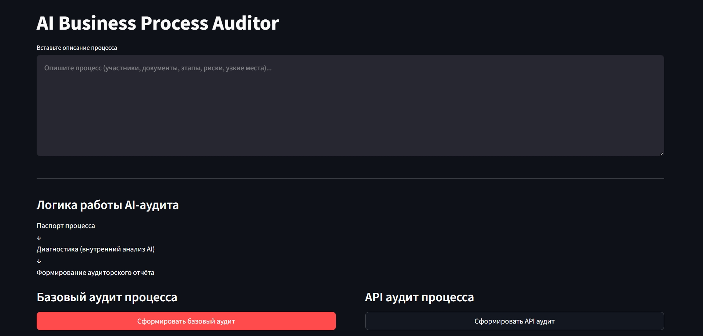
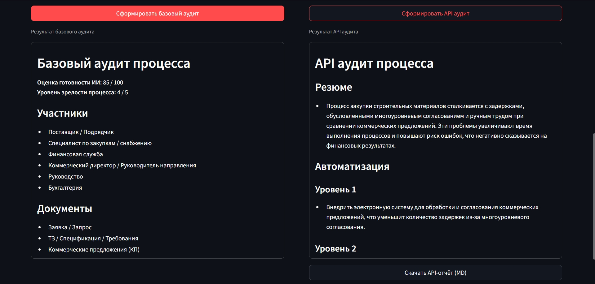

# AI Business Process Auditor

AI-powered Streamlit system for auditing business processes using OFFLINE analysis and multi-stage API pipeline.

---

## 🚀 What this project does

AI Business Process Auditor helps to:

- analyze business processes in a structured way
- detect automation opportunities
- generate structured audit reports
- produce ROI-oriented improvement hypotheses

The system supports:

- OFFLINE deterministic analysis
- API-enhanced AI audit (multi-stage pipeline)
- reviewer pass for output normalization

---

## Demo

### Interface



### API Report



---

## 🇷🇺 Описание проекта

AI Business Process Auditor — это Streamlit-приложение для AI-аудита бизнес-процессов.

Система сочетает:

- OFFLINE анализ (стабильный fallback)
- API аудит через многофазный AI pipeline
- нормализацию итогового отчёта через reviewer-pass

---

## 🇬🇧 English Description

AI Business Process Auditor is a Streamlit-based system for AI-powered business process auditing.

It combines:

- OFFLINE deterministic analysis
- multi-phase API audit pipeline
- reviewer pass for output normalization

---

## Возможности / Features

- OFFLINE process passport extraction
- API audit with multi-phase generation
- reviewer-based normalization
- structured audit reports
- markdown export
- Streamlit dual-column UI

---

## Архитектура / Architecture

### Pipeline overview

1. **OFFLINE passport extraction**  
   `extract_process_passport_offline` → `format_passport_md`

2. **Phase 1 — Diagnosis (API)**  
   Fast diagnostic pass: key issues, risks, constraints.

3. **Phase 2 — Final report (API)**  
   Generates the final structured audit report:
   - API аудит процесса
   - Резюме
   - Автоматизация (Уровень 1–3)
   - Быстрые улучшения
   - ROI гипотезы
   - Ограничения

4. **Phase 3 — Reviewer pass (API)**  
   Normalizes style and structure:
   - short headings (no parentheses)
   - no model questions
   - no “card references / based on …”
   - format validation + retry if output looks broken

---

## Структура проекта / Project Structure

### Repository layout

```text
ai-business-process-auditor/
├── app/
│   ├── llm/                # API + offline LLM clients
│   ├── main.py             # Streamlit entrypoint
│   ├── pipeline.py         # run_api_audit + multi-phase pipeline
│   ├── prompts.py          # prompt templates
│   ├── render.py           # markdown rendering helpers
│   └── schemas.py          # data models / validation
├── docs/                   # architecture, pipeline, report format (to be filled)
├── examples/               # sample input/output (to be filled)
├── screenshots/            # UI and report screenshots (to be filled)
├── .env.example            # env template (no secrets)
├── requirements.txt
└── README.md
```
---

## Установка / Installation

### 1. Clone repository

```bash
git clone https://github.com/paracriptus-oss/ai-business-process-auditor.git
cd ai-business-process-auditor
```

### 2. Create virtual environment

```bash
python -m venv .venv
```

Activate:

**Windows**

```bash
.venv\Scripts\activate
```

**Linux / Mac**

```bash
source .venv/bin/activate
```

### 3. Install dependencies

```bash
pip install -r requirements.txt
```

### 4. Configure environment

Create `.env` file from template:

```bash
copy .env.example .env   # Windows
cp .env.example .env     # Linux/Mac
```

---

## Запуск / Run

Run Streamlit app:

```bash
streamlit run app/main.py
```

---

## API Configuration

The project uses `.env` configuration.

Main parameters:

- OPENAI_API_KEY
- OPENAI_MODEL
- OPENAI_BASE_URL
- LLM_MODE (offline / api)

---

## Формат отчёта / Report Structure

The API audit produces a normalized report with a fixed structure:

- API аудит процесса
- Резюме
- Автоматизация (Уровень 1–3)
- Быстрые улучшения
- ROI гипотезы
- Ограничения

Formatting rules:

- short headings (no parentheses)
- unified tone and style
- no model questions
- no references like “based on card X”
- broken-output detection + retry

---

## Roadmap

- [ ] add cloud deployment
- [ ] PDF export
- [ ] multi-process comparison
- [ ] scoring metrics

---

## License

MIT